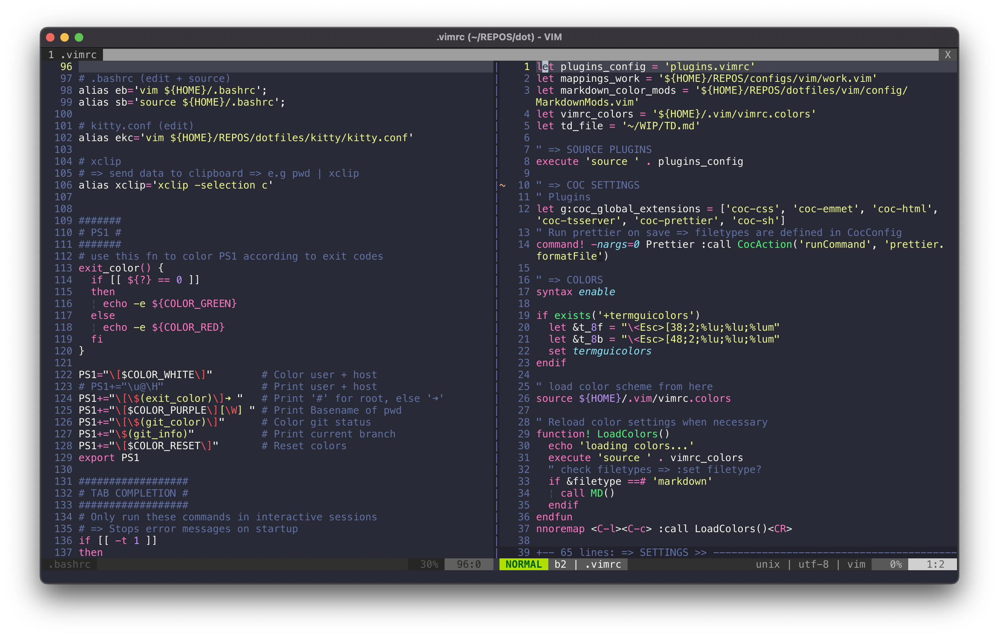

This is a collection of my dotfiles.
They are used to configure the development tools I use on a daily basis.

- [bash](https://www.gnu.org/software/bash/)
- [vim](https://github.com/vim/vim)
- [kitty terminal](https://github.com/kovidgoyal/kitty)

  

